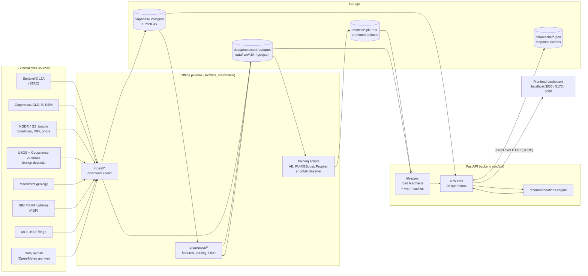
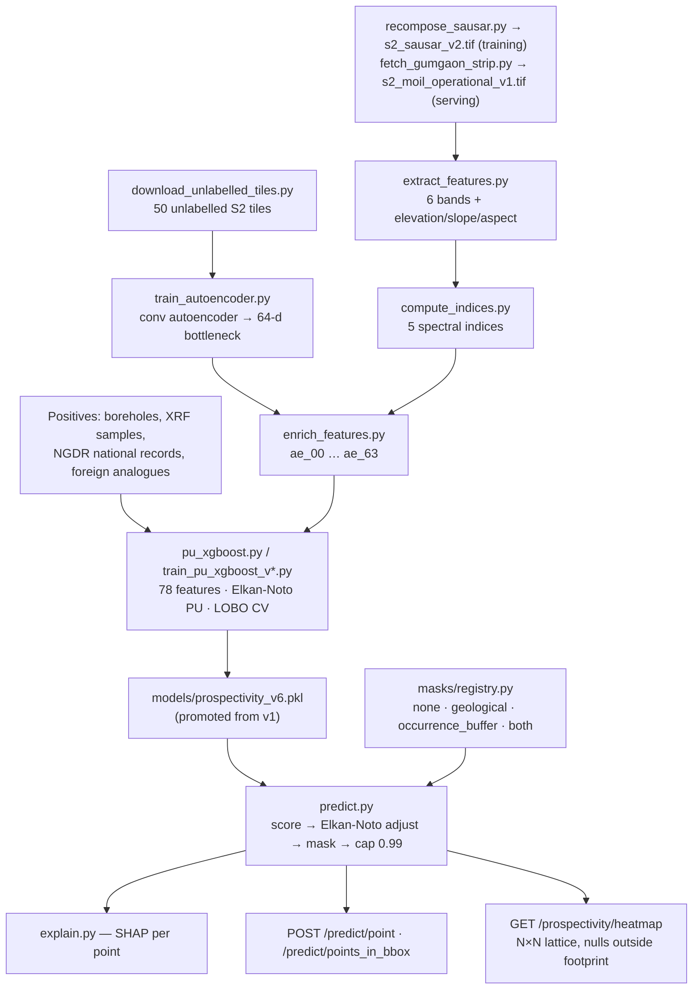
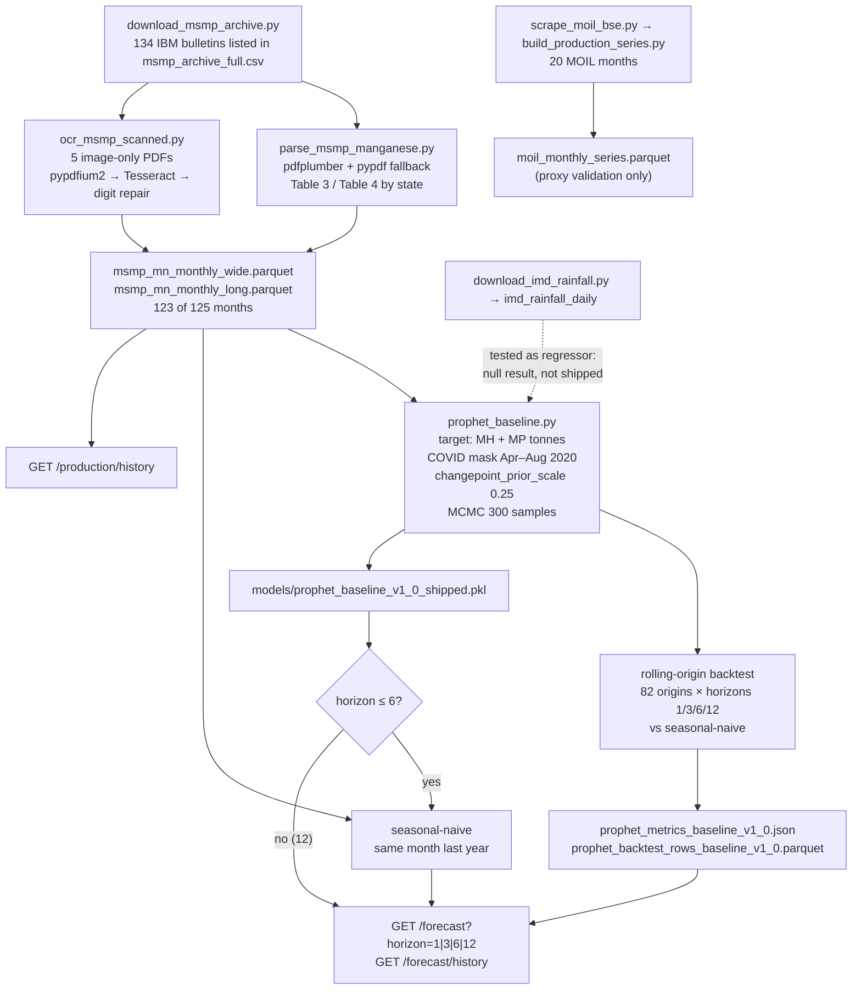
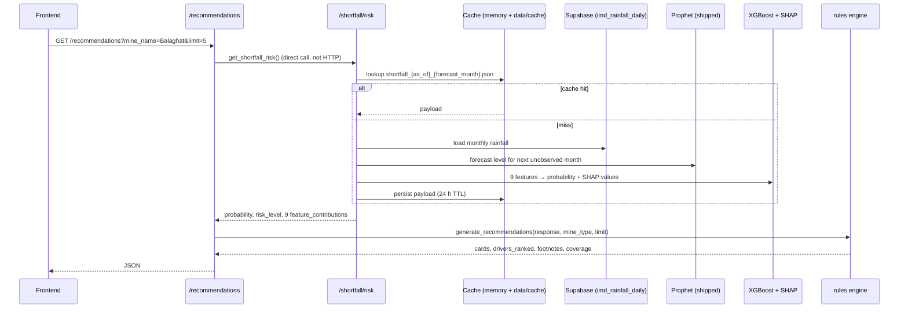
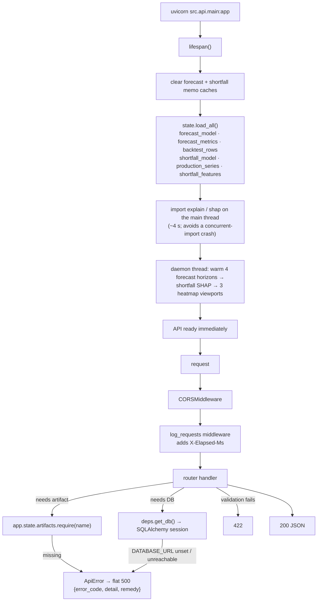
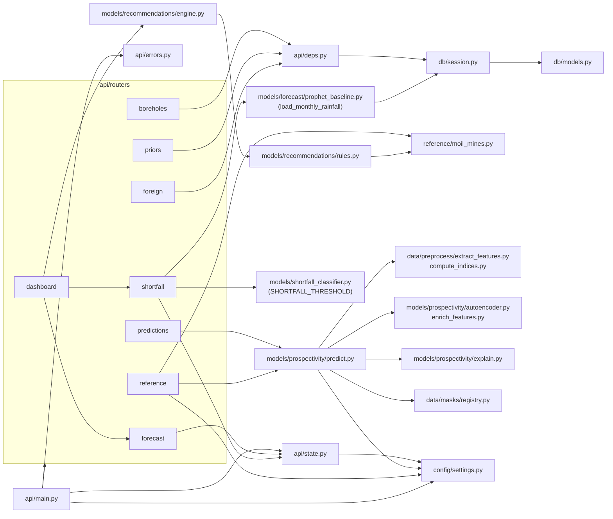

# System Architecture — Manganese Prospectivity & MOIL Production Intelligence

**Project:** SIH 2026 · SIH26009 · Ministry of Steel / MOIL Limited
**API version:** 0.2 · **Contract:** v1.8 (`docs/phase_4/api_contracts.md`) · **Operations:** 26
**Tests:** 283 passed, 1 skipped

This document explains what the system does, how data flows through it, how
the pieces are wired together, what every folder and file contains, and which
technologies are used where. For setup from a clean clone see `BOOTSTRAP.md`;
for known defects see `docs/known_issues.md`.

---

## 1. What the system does

The problem statement asks for three capabilities. The system delivers each as
a separate pipeline that meets in one FastAPI backend:

| capability | question it answers | core model | served by |
|---|---|---|---|
| **Prospectivity mapping** | *Where is manganese likely to be found?* | PU-learning XGBoost on Sentinel-2 + DEM + autoencoder features | `/predict/*`, `/prospectivity/heatmap` |
| **Production forecasting** | *How much will MOIL's region produce?* | Seasonal-naive (horizons 1–6) and Prophet (horizon 12) on a 123-month IBM MSMP series, routed by backtest | `/forecast`, `/forecast/history`, `/production/history` |
| **Shortfall risk + corrective actions** | *Will next month disappoint, why, and what should be done?* | XGBoost classifier + SHAP → rules engine | `/shortfall/risk`, `/recommendations`, `/dashboard/summary` |

The project was built in phases, and the folder layout still reflects them:

| phase | scope |
|---|---|
| **Phase 1** | Database, reference data loaders (boreholes, priors, foreign deposits, NGDR), raster feature extraction |
| **Phase 2** (2.5–2.9) | Prospectivity model: autoencoder, PU-XGBoost v1→v6, geological masks, SHAP |
| **Phase 3** / **3.2** | MSMP production series (PDF parsing + OCR), Prophet forecast, rainfall regressor test, shortfall classifier |
| **Phase 4** Bucket 1 | Dashboard backend: mines reference, heatmap lattice, forecast/shortfall wiring, caching |
| **Phase 4** Bucket 2 | Corrective-actions rules engine and scenario replay |

---

## 2. High-level architecture



Three design rules shape the whole backend:

1. **Serve promoted artifacts only.** Training scripts write to scratch paths;
   the API reads `*_shipped` / explicitly versioned files. A training run once
   overwrote the served forecast model and the API silently returned a rejected
   variant with `200`, so the split is enforced in `src/api/state.py` and
   `src/models/prospectivity/predict.py`.
2. **Degrade per component, never globally.** Each artifact records its own
   load error. A missing shortfall model breaks `/shortfall/risk` with a
   machine-readable `500 model_not_loaded`, but `/production/history` still
   answers, and `/dashboard/summary` returns `null` for that block and names it
   in `degraded`.
3. **Explain everything.** Prospectivity scores and shortfall probabilities both
   ship with SHAP contributions; recommendations cite the exact feature that
   triggered them.

---

## 3. System workflows

### 3.1 Prospectivity workflow (Phase 1 → 2)



**Feature vector (78 columns):**

| group | columns | count |
|---|---|---|
| Sentinel-2 bands | `b02 b03 b04 b08 b11 b12` | 6 |
| Terrain (DEM) | `elevation slope aspect` | 3 |
| Spectral indices | `mn_ratio_swir` (B11/B12), `iron_ratio` (B04/B03), `ferrous_ratio` (B11/B08), `ndvi`, `normalised_burn_ratio_swir` | 5 |
| Autoencoder embedding | `ae_00` … `ae_63` | 64 |

**Why PU learning:** only confirmed *positives* exist (known deposits); there are
no confirmed negatives. Unlabelled points are sampled as background, XGBoost is
trained positive-vs-unlabelled, and the Elkan-Noto constant `c` rescales the
output to a probability. Because division by `c` pins confident points to 1.0,
scores are capped at `SCORE_CAP = 0.99`.

**Masks** are applied after the Elkan-Noto adjustment and before the cap. They
exist because the raw model flags cropland north of Nagpur; the geological mask
restricts to Precambrian basement, the occurrence buffer to ground within 5 km
of a confirmed occurrence.

**Heatmap:** `/prospectivity/heatmap` builds a true lattice aligned to the
requested bbox (`heatmap_grid()` in `predict.py`) because `POST /predict/points_in_bbox`
returns a score-sorted point set that cannot be rendered as a grid. Cells with
no real imagery are `null`.

**Serving imagery:**

- **Training mosaic:** v6 was trained on `s2_sausar_v2.tif`.
- **Serving mosaic:** the API scores from `settings.S2_SERVING_PATH` =
  `s2_moil_operational_v1.tif`, the training mosaic copied byte-for-byte plus a
  western strip that brings Gumgaon inside the footprint. The DEM follows
  the same pattern (`dem_moil_operational.tif`).
- **The old mismatch:** until 2026-09-13 the API silently scored from
  `s2_nagpur_smoke_test.tif`, a different composite whose unflagged gaps read
  as zero reflectance (known issue #7).
- **The imagery check:** `has_imagery()` requires all six bands to be
  non-null and non-zero before a point is scored. Otherwise `/predict/point`
  returns `404 no_imagery_at_location` and heatmap cells are `null`.

### 3.2 Production data + forecasting workflow (Phase 3)



The forecast target is **Maharashtra + Madhya Pradesh** manganese output —
MOIL's operating region — because MOIL publishes no mine-level monthly figures
and only ~20 months of company totals. The MOIL series is kept purely to check
that the regional series tracks the company.

`/forecast` is **horizon-adaptive**. On the shipped backtest, seasonal-naive
(same calendar month one year earlier) beats Prophet at 1, 3 and 6 months
(MAPE 9.67 / 10.05 / 10.71 vs 10.93 / 11.74 / 12.54). Prophet wins only at
12 months (9.92 vs 10.16). So `route_model()` in `forecast.py` serves
seasonal-naive up to 6 months and Prophet beyond, and every response carries
`model_used` and `reason`. A trend-adjusted naive was backtested and rejected.

Each call returns **one target period**: prediction, 80% interval (MCMC for
Prophet; empirical backtest ratio quantiles for seasonal-naive), components,
and the served model's backtest accuracy. `/forecast/history` holds both
models' per-horizon metrics and the 82 origins. The shortfall classifier still
uses the Prophet forecast, which is what it was trained on.

### 3.3 Shortfall risk → recommendations workflow (Phase 3.2d → 4)



**Shortfall definition:** actual production below **90%** of the Prophet forecast
for that month. Labels come from a *rolling-origin* backtest (never in-sample),
and only origins with ≥ 60 months of training history are used, which removes
labels caused by an immature Prophet fit.

**Nine features, all causally available at prediction time:**

| feature | meaning |
|---|---|
| `deviation_lag1`, `deviation_lag2` | how far the last two months were from forecast |
| `rainfall_concurrent_mm`, `rainfall_lag1_mm`, `rainfall_lag2_mm` | district rainfall this month and the two before |
| `month_sin`, `month_cos` | cyclical season |
| `production_trend_3mo` | mean of last 3 months ÷ mean of the 3 before |
| `prophet_forecast_level` | forecast tonnes for the target month |

**Rules engine** (`src/models/recommendations/`):

1. Group the nine SHAP values into four **drivers** — rainfall, production
   history, forecast level, seasonal.
2. Rank drivers by **positive SHAP only**: features arguing *for* a shortfall
   generate actions; features arguing against it explain why things are fine.
3. Apply **risk bands**: `< 0.25` → no cards; `0.25–0.60` → 1–2 cards from the top
   driver; `≥ 0.60` → all three action types (schedule adjustment, blasting
   optimisation, equipment redeployment), subject to `limit`, with
   diversity-preserving truncation.
4. Render one of **32 templates** filtered by mine type (underground/opencast),
   using only equipment MOIL actually operates, citing the triggering feature.
5. Attach **footnotes** when a feature looks like good news but raises risk
   (mean reversion).

`/recommendations/scenario/{month}` replays a real historical month
(`2021-04`, `2024-02`) through the same model, so the engine can be
demonstrated when current risk is low.

### 3.4 API request lifecycle



Cold vs warm latencies: `/forecast` ~0.96 s → 2–37 ms; `/shortfall/risk` ~6.6 s
→ 2–37 ms; `/prospectivity/heatmap` ~38 s → ~36 ms. Warming means demo requests
should never pay the cold cost.

---

## 4. Integration map

How the major modules call each other at runtime:



Key integration points:

- **`config/settings.py`** is the single source of paths (`DATA_RAW`,
  `DATA_PROCESSED`, `MODELS_DIR`), the Sausar bbox, band order, mine coordinates,
  warm viewports and scenario months. It reads `.env` via pydantic-settings.
- **`api/state.py`** is the only place the served forecast and shortfall
  artifacts are named. `predict.py` does the same for the prospectivity model
  (`SHIPPED_MODEL_PATH`), overridable with `PROSPECTIVITY_MODEL`,
  `PROSPECTIVITY_S2`, `PROSPECTIVITY_AE` environment variables.
- **Inference reuses training code.** `predict.py` calls the same
  `extract_features_bulk`, `add_indices` and `embed_points` the training set was
  built with, so there is no separate serving feature path to drift.
- **The dashboard composes in-process.** `/dashboard/summary` and
  `/recommendations` call `get_forecast` / `get_shortfall_risk` as Python
  functions, hitting their memoised payloads instead of making HTTP calls.
- **The rules engine is decoupled from the model.** It consumes only the
  `/shortfall/risk` response *shape*, so it is unit-tested against hand-built
  responses without SHAP.
- **The database is optional for most endpoints.** Only `/boreholes`,
  `/priors`, `/foreign` (direct table reads) and `/shortfall/risk` (rainfall)
  need `DATABASE_URL`; everything else reads local parquet/pickle.

---

## 5. API surface (26 operations)

| router file | method | route | needs DB | purpose |
|---|---|---|---|---|
| `main.py` | GET | `/` | — | health + API version |
| `boreholes.py` | GET | `/boreholes` | ✔ | list 46 NGDR borehole collars |
| | GET | `/boreholes/{id}` | ✔ | one borehole |
| | GET | `/boreholes/{id}/features` | ✔ | raster features at its collar |
| `priors.py` | GET | `/priors` | ✔ | block grade envelopes |
| | GET | `/priors/{block_name}` | ✔ | one block |
| `foreign.py` | GET | `/foreign` | ✔ | paginated foreign analogue deposits |
| `predictions.py` | POST | `/predict/point` | — | score one lon/lat + SHAP + mask decision |
| | POST | `/predict/points_in_bbox` | — | ranked candidate points in a bbox (not griddable) |
| | POST | `/predict/bbox` | — | deprecated alias of the above; adds `X-Deprecated` header |
| | GET | `/masks` | — | mask metadata |
| | GET | `/predictions/{prediction_id}` | ✔ | stored prediction |
| | POST | `/train` | — | background retrain (FastAPI `BackgroundTasks`) |
| | GET | `/train/{task_id}` | — | retrain status |
| `forecast.py` | GET | `/production/history` | — | MSMP monthly series, coverage, OCR flags |
| | GET | `/forecast` | — | one-period forecast; seasonal-naive at 1/3/6, Prophet at 12 |
| | GET | `/forecast/history` | — | per-horizon metrics for both models + 82 backtest origins |
| | POST | `/forecast/retrain` | — | `501` — disabled in demo |
| | GET | `/forecast/retrain/{task_id}` | — | retrain status |
| `shortfall.py` | GET | `/shortfall/risk` | ✔ | next-month probability + 9 SHAP contributions |
| `reference.py` | GET | `/mines` | — | 10 MOIL mines, type counts |
| | GET | `/mines/{mine_name}` | — | one mine + fleet vocabulary |
| | GET | `/prospectivity/heatmap` | — | N×N score lattice (grid 8–128, masks) |
| `dashboard.py` | GET | `/dashboard/summary` | partial | landing aggregate with `degraded` list |
| | GET | `/recommendations` | via shortfall | corrective-action cards |
| | GET | `/recommendations/scenario/{month}` | via shortfall | replay a historical month |

Error model: all validation → `422`; server faults → flat `500`
`{"error_code", "detail", "remedy"}` with codes such as `model_not_loaded`,
`data_not_loaded`, `prediction_failed`; demo-disabled → `501`. Full shapes are in
`docs/phase_4/api_contracts.md`. Interactive docs at `http://127.0.0.1:8000/docs`.

---

## 6. Technology stack

| layer | technology | used for |
|---|---|---|
| Language / runtime | **Python 3.11** (`.python-version`, `pyproject.toml`) | everything |
| Web API | **FastAPI**, **Uvicorn**, **Pydantic v2**, **pydantic-settings**, python-dotenv | routers, validation, schemas, `.env` config |
| Database | **Supabase Postgres + PostGIS**, **SQLAlchemy 2.0**, **GeoAlchemy2**, psycopg 3 / psycopg2 | reference tables, rainfall, geometry (EPSG:4326) |
| Geospatial | **rasterio**, rioxarray, xarray, **geopandas**, **shapely**, **pyproj** | raster sampling, CRS transforms, mask polygons |
| Satellite access | **pystac-client**, **stackstac** | Sentinel-2 L2A and Copernicus DEM retrieval |
| Prospectivity ML | **PyTorch** (conv autoencoder, domain-adversarial variant), **XGBoost**, **scikit-learn**, imbalanced-learn | 64-d embeddings, PU classifier, CV |
| Forecasting | **Prophet** (Stan, MCMC), statsmodels, scipy | production forecast, backtests |
| Shortfall | **XGBoost**, **SHAP** (`TreeExplainer`) | risk classifier and explanations |
| Document extraction | **pdfplumber**, pypdf, **pypdfium2**, **Tesseract OCR 5** | MSMP bulletin tables, scanned PDFs |
| Scraping | requests, BeautifulSoup4, lxml, openpyxl | IBM archive, BSE filings |
| Data formats | pandas, numpy, **pyarrow/Parquet**, GeoJSON, GeoTIFF, joblib pickles, `.pt` weights | processed data and artifacts |
| Experiment tracking | MLflow (`mlruns/`, gitignored) | training runs |
| Notebooks / viz | Jupyter, matplotlib, plotly, folium, contextily | smoke tests, diagnostics figures |
| Quality | **pytest**, httpx `TestClient`, ruff (line length 100), mypy | 239 tests, lint, types |

`requirements.txt` also declares `celery`, `redis` and `torch-geometric`; the
current code paths do not depend on them (background training uses FastAPI
`BackgroundTasks`).

---

## 7. File and folder structure

Legend: **[git]** tracked in the repository · **[bundle]** shipped in the release
tarball (see `BOOTSTRAP.md`) · **[local]** generated or downloaded, gitignored.

```
manganese-prospectivity/
├── ARCHITECTURE.md          this document
├── BOOTSTRAP.md             clean-clone setup, artifact bundle, env scope
├── README.md                short project blurb
├── requirements.txt         pip dependencies by phase
├── pyproject.toml           project metadata, ruff / mypy / pytest config
├── .python-version          3.11
├── .env.example             DATABASE_URL / SUPABASE_* template with scope notes
├── .gitignore               excludes /models/, data/raw, data/processed, data/cache, *.pkl, *.pt, mlruns, .env
│
├── src/                     all production code                                 [git]
│   ├── api/                 FastAPI backend
│   ├── config/              settings, paths, controlled vocabularies
│   ├── data/                ingest, preprocess, masks
│   ├── db/                  ORM models, engine, init
│   ├── models/              prospectivity, forecast, shortfall, recommendations
│   ├── reference/           MOIL mine reference data
│   └── viz/                 (empty placeholder package)
│
├── tests/                   pytest suites                                       [git]
├── scripts/                 runners, DB migrations, diagnostics                 [git]
├── docs/                    design notes, contracts, summaries                  [git]
├── notebooks/               smoke-test notebook + figures                       [git]
│
├── models/                  trained artifacts                                   [bundle/local]
├── data/
│   ├── raw/                 downloaded sources                                  [bundle/local]
│   ├── processed/           parquet / json outputs                              [bundle/local]
│   └── cache/               API response caches                                 [local]
└── mlruns/                  MLflow tracking                                     [local]
```

### 7.1 `src/api/` — FastAPI backend

| file | contents |
|---|---|
| `main.py` | App factory. `API_VERSION = "0.2"`; `lifespan()` clears memo caches, calls `load_all()`, starts the warming daemon thread; CORS for localhost 3000/5173/8080; `log_requests` middleware (`X-Elapsed-Ms`); `GET /`; registers the 8 routers. |
| `state.py` | `Artifact` / `AppState` dataclasses; names the promoted files (`SHIPPED_FORECAST_MODEL`, `SHIPPED_FORECAST_METRICS`, `SHIPPED_BACKTEST_ROWS`, `SHIPPED_SHORTFALL_MODEL`, `PRODUCTION_SERIES`, `SHORTFALL_FEATURES`) and version strings; `load_all()` never raises, records per-artifact errors; `require()` raises `ModelNotLoaded`. |
| `errors.py` | `ApiError` base plus `ModelNotLoaded`, `DataNotLoaded`, `PredictionFailed`, `NotImplementedInDemo`, `NoImageryAtLocation` (404); `api_error_handler` renders the flat `{error_code, detail, remedy}` body. |
| `deps.py` | `get_db()` session dependency; converts missing `DATABASE_URL` and `SQLAlchemyError` into `DataNotLoaded` with a remedy. |
| `schemas.py` | Pydantic response/request models: `BoreholeOut`, `BlockPriorOut`, `ForeignDepositOut/Page`, `PredictionOut`, `FeatureOut`, `HealthOut`, `PredictPointIn/Out`, `ShapContribution`, `MaskInfoOut`, `PredictBboxIn/Out`, `GridPrediction`, training task models. |
| `routers/boreholes.py` | `/boreholes`, `/boreholes/{id}`, `/boreholes/{id}/features` (DB). |
| `routers/priors.py` | `/priors`, `/priors/{block_name}` (DB). |
| `routers/foreign.py` | `/foreign`, paginated (DB). |
| `routers/predictions.py` | Phase 2 scoring: `/predict/point`, `/predict/points_in_bbox` (plus the deprecated `/predict/bbox` alias), `/masks`, `/predictions/{id}`, `/train`, `/train/{task_id}`. |
| `routers/forecast.py` | `/production/history` (window-scoped coverage, text vs OCR extraction method); `/forecast` (horizon routing via `route_model`, seasonal-naive or Prophet payload, memoised per horizon, served-model accuracy); `/forecast/history` (both models compared per horizon); `/forecast/retrain` (501); `/forecast/retrain/{task_id}`; `seasonal_naive_backtest()`, `clear_forecast_cache()`. |
| `routers/shortfall.py` | `/shortfall/risk`: builds the 9 features for the next unobserved month, scores, runs SHAP, adds human labels/display values, rainfall provenance and model metadata; memory + disk cache (`data/cache/shortfall_{as_of}_{month}.json`, 24 h). |
| `routers/reference.py` | `/mines`, `/mines/{mine_name}`, `/prospectivity/heatmap` (grid size 8–128, mask validation, disk cache keyed by bbox/grid/mask/model version); `compute_heatmap()` used by warming. |
| `routers/dashboard.py` | `/dashboard/summary` (latest actual, next forecast, shortfall, series and model health, mine counts, `degraded`), `/recommendations`, `/recommendations/scenario/{month}`; shared parameter validation. |

### 7.2 `src/config/`

| file | contents |
|---|---|
| `settings.py` | `PROJECT_ROOT`, `DATA_RAW`, `DATA_PROCESSED`, `MODELS_DIR`; smoke-test raster paths (Phase 1 features); `S2_TRAINING_PATH`, `S2_SERVING_PATH`, `DEM_SERVING_PATH`; `HEATMAP_WARM_VIEWPORTS` (full_bbox, balaghat_bhandara, balaghat_ukwa); `SCENARIO_MONTHS`; Sausar `BBOX [79.0, 21.3, 80.6, 22.1]`; `S2_BANDS`; `MOIL_MINES` coordinates; `Settings` (reads `.env`: `DATABASE_URL`, `SUPABASE_URL`, `SUPABASE_KEY`); `require_database_url()`. |
| `constants.py` | `DepositType`, `PriorType` enums and `classify_deposit_type()` shared by ORM, loaders and API. |

### 7.3 `src/db/` — database layer

| file | contents |
|---|---|
| `models.py` | SQLAlchemy 2.0 ORM, geometries in EPSG:4326. Tables: `boreholes`, `block_grade_priors`, `surface_samples`, `foreign_deposits`, `ngdr_national`, `predictions`, `moil_monthly_production`, `imd_rainfall_daily`, `production_forecasts`, `shortfall_risks`; `ALL_TABLES` in FK order. |
| `session.py` | `get_engine()`, `get_session_factory()`, `SessionLocal`, `get_session()` for Supabase/PostGIS. |
| `init_db.py` | Enables the PostGIS extension and creates all tables. |

### 7.4 `src/data/ingest/` — acquisition and loading

| file | contents |
|---|---|
| `__init__.py` | Shared helpers: `to_float/int/str/date`, `valid_lonlat`, `wkt_point`, `open_session`, `report`. |
| `load_boreholes.py` | NGDR borehole collars → `boreholes`. |
| `load_priors.py` | Block grade priors CSV → `block_grade_priors` (infers prior type and sample count). |
| `load_surface_samples.py` | Katori-Jhiriya XRF samples → `surface_samples`. |
| `load_foreign.py` | USGS + Geoscience Australia compilation → `foreign_deposits`. |
| `load_ngdr_bundle.py` | Every GeoJSON layer of the NGDR manganese bundle → `ngdr_national`. |
| `fetch_macrostrat_geology.py` | Precambrian formation polygons over the Sausar belt (geological mask source). |
| `recompose_sausar.py` | Rebuilds the Sausar Sentinel-2 mosaic with a wider search to reach < 5% nodata (`s2_sausar_v2.tif`, the training mosaic). |
| `fetch_gumgaon_strip.py` | Composites a western S2 + DEM strip `[78.93, 21.35, 79.03, 21.45]` with recompose_sausar's parameters and writes the serving rasters, verifying training pixels are unchanged. |
| `download_unlabelled_tiles.py` | 50 Sentinel-2 L2A tiles for autoencoder pretraining. |
| `download_foreign_cluster_tiles.py` | Tiles centred on foreign deposit clusters so pretraining covers foreign labels. |
| `cluster_ngdr_for_tiles.py` | Clusters 622 NGDR records; plans which need new tiles. |
| `download_ngdr_tiles.py` | Downloads tiles for those NGDR clusters. |
| `composite_ngdr_tiles.py` | Re-fetches NGDR tiles as multi-scene composites. |
| `download_global_dem.py` | Copernicus GLO-30 DEM for every unlabelled tile. |
| `download_msmp_archive.py` | Bulk, idempotent download of IBM MSMP bulletins; drops superseded advance releases; rejects HTML error pages. |
| `download_imd_rainfall.py` | Daily district rainfall for MOIL districts → `imd_rainfall_daily`. |
| `scrape_moil_bse.py` | MOIL monthly production press releases from BSE India. |

### 7.5 `src/data/preprocess/` — features and parsing

| file | contents |
|---|---|
| `extract_features.py` | Samples 6 Sentinel-2 bands and DEM elevation/slope/aspect at points (`extract_features_at_point`, `extract_features_bulk`). |
| `compute_indices.py` | Adds the 5 spectral index columns. |
| `build_training_set.py` | Phase 1 training table: boreholes + priors + raster features. |
| `label_deposit_types.py` | Deterministic deposit-type labels from host rock, block and geology. |
| `parse_msmp_manganese.py` | Extracts monthly manganese tonnes by state from MSMP PDFs (page classification, Table 3/4 parsing, geography canonicalisation, sanity checks) → wide + long parquet. |
| `ocr_msmp_scanned.py` | Recovers the 5 image-only bulletins: render with pypdfium2, Tesseract OCR, `repair_digits`, `restore_decimals`, neighbourhood check. |
| `build_production_series.py` | MOIL monthly/quarterly series from cached BSE releases (prefers monthly, reconstructs from cumulative). |

### 7.6 `src/data/masks/`

| file | contents |
|---|---|
| `geological_mask.py` | `GeologicalMask` — point-in-Precambrian-polygon filter. |
| `occurrence_buffer_mask.py` | `OccurrenceBufferMask` — union of 5 km buffers around Indian positives; builds the GeoJSON. |
| `registry.py` | `VALID_MASKS`, `apply_mask()`, `describe()` for `GET /masks`. |

`src/data/smoke_test.py` — the original Phase 1 download of Sentinel-2 and DEM
over Nagpur/Balaghat that produced the two `*_smoke_test.tif` rasters.

### 7.7 `src/models/prospectivity/`

| file | contents |
|---|---|
| `autoencoder.py` | `MnAutoencoder` conv autoencoder, `TileDataset`, `extract_features`, `load_autoencoder` (64-d bottleneck). |
| `train_autoencoder.py` | Trains it on the unlabelled tiles → `models/autoencoder_v1.pt`. |
| `domain_adversarial_ae.py` | Gradient-reversal variant learning country-invariant features (→ `autoencoder_v2_adversarial.pt`, experimental). |
| `enrich_features.py` | Appends `ae_00…ae_63` embeddings to the training set (`embed_points`, `AE_COLUMNS`). |
| `enrich_foreign.py` / `enrich_ngdr.py` | Build the 78-d vector for foreign and NGDR positives from whichever tile covers them; NGDR records weighted by location precision. |
| `pu_xgboost.py` | PU dataset construction (`build_dataset`, unlabelled sampling local/global), `BASE_FEATURES`, `ALL_FEATURES`. |
| `train_pu_xgboost.py` | v1 training with leave-one-block-out CV, top-k precision, Elkan-Noto `c` estimation. |
| `train_pu_xgboost_v3.py` / `_v4.py` / `_v5.py` | Phases 2.7–2.9: regularisation levers, NGDR national positives with spatial folds, terrain-corrected global sampling. |
| `explain.py` | `load_bundle`, SHAP `explain_prediction` / `explain_batch`. |
| `predict.py` | Serving service: `SHIPPED_MODEL_PATH` (v6), env overrides, `build_feature_frame`, `score_frame`, `cap_score`, `uncertainty_from_probability`, `has_imagery` (all six bands non-null and non-zero), `predict_point` (returns `None` without imagery), `grid_points`, `predict_bbox`, `heatmap_grid`. |

### 7.8 `src/models/forecast/`

| file | contents |
|---|---|
| `prophet_baseline.py` | `load_production`, `load_moil_validation`, `load_monthly_rainfall` (DB), `build_frame`, `mask_covid`, `fit_prophet`, `mape`/`rmse`, rolling-origin `backtest`, variants (baseline vs rainfall regressor), `_future_regressors` with regressor provenance. |
| `lstm_residual.py` | LSTM on Prophet residuals — **Phase 3.2e, deferred and not trained** (source of the single skipped test). |

### 7.9 Shortfall and recommendations

| file | contents |
|---|---|
| `src/models/shortfall_classifier.py` | **Shipped classifier.** Rolling-origin labels (90% threshold, ≥ 60 training months), 9 causal features, stratified windows, persistence heuristics, ship criterion (F1 gain over majority ≥ 0.05, over heuristic ≥ 0.03, ≥ 5 true positives), SHAP plot, writes `shortfall_classifier_v1.pkl`. |
| `src/models/shortfall/xgboost_risk.py` | Retired Phase 3 scaffold with an older feature set; not served. |
| `src/models/recommendations/rules.py` | 32 templates; `DRIVER_FEATURES`, `DRIVER_LABELS`, `ACTION_TYPES`, `PRIORITY_RANK`, `COUNTERINTUITIVE`; `rules_for(driver, mine_type)`. |
| `src/models/recommendations/engine.py` | `driver_scores` (positive SHAP), `is_counterintuitive_contribution`, `footnotes_for`, rendering with `{trigger_label}`/`{trigger_value}`, coverage enforcement, `generate_recommendations`, `catalog_size`; bands `LOW_RISK_CEILING 0.25`, `HIGH_RISK_FLOOR 0.60`. |

### 7.10 `src/reference/`

| file | contents |
|---|---|
| `moil_mines.py` | The 10 MOIL mines (state, district, type, coordinates, disclosed equipment and capacity), `UNDERGROUND_FLEET_VOCAB`, `OPENCAST_FLEET_VOCAB`, `GENERIC_FLEETS`, `MINE_TYPE_COUNTS`, `SOURCE_URLS`. |

### 7.11 `tests/`

| file | covers |
|---|---|
| `conftest.py` | Fixtures: DB session, API client, dummy features, trained model path. |
| `test_api.py` | Phase 1 endpoints (health, boreholes, priors, foreign) — DB-backed. |
| `test_api_phase4.py` | 90 tests: lifespan loading, shipped artifacts, CORS, logging, every Phase 4 endpoint's shape, validation, 500 codes, caching, route registry (pins all 26 operations). |
| `test_ingest.py` | Loaded table counts and geometry integrity — DB-backed. |
| `test_features.py` | Raster extraction and index ranges. |
| `test_masks.py` | Geological and buffer masks at known coordinates. |
| `test_serving_imagery.py` | Serving mosaic path, training pixels served unchanged, no-imagery 404 and null heatmap cells, Gumgaon scoreable after the strip. |
| `test_prospectivity.py` | Autoencoder, 78-d enrichment, PU training, SHAP additivity, uncertainty, v6 promotion ordering, heatmap lattice with nulls. |
| `test_msmp.py` | Downloader idempotency/dedup, parser on page drift and pre-decimal era, OCR digit/decimal repair, output schema. |
| `test_forecast.py` | Prophet training, metrics, fiscal year, LSTM (skipped), shortfall bundle, forecast endpoints. |
| `test_shortfall.py` | Label definition, causal features, no leakage, provenance, ship criterion, heuristics. |
| `test_recommendations.py` | 44 tests: risk bands, positive-SHAP ranking, trigger citation, mine vocabularies, catalog coverage, limit/diversity, footnotes, both endpoints. |
| `test_moil_mines_reference.py` | Mine reference integrity and source URLs. |

### 7.12 `scripts/`

| path | contents |
|---|---|
| `run_api.py` | Dev server launcher. |
| `load_all.py` | Runs every Phase 1 loader in dependency order and prints table counts. |
| `migrations/` | Idempotent schema changes: `add_deposit_type_columns`, `add_forecast_tables`, `add_ngdr_geom_type`, `add_prediction_mask_cols`, `fix_katori_n_samples`. |
| `diagnostics/` | Investigation scripts that drove model decisions: `compare_v1_vs_v2`, `compare_versions`, `debug_balaghat` (why v1 scored Balaghat ~0), `debug_farmland` (Nagpur cropland false positive), `diag1_foreign_ablation`, `diag2_coordinate_sanity`, `diag3_feature_families`, `test_masks` (against running API), `v4_feature_importance`. |

### 7.13 `docs/`

| file | contents |
|---|---|
| `phase_4/api_contracts.md` | **Source of truth for the frontend** — request/response shapes for every endpoint (v1.6). |
| `phase_4/bucket_1_summary.md` | Dashboard backend: endpoints, artifacts, cache warming, limitations. |
| `phase_4/bucket_2_summary.md` | Rules engine: taxonomy, ranking, bands, scenarios, limitations. |
| `phase_4/recommendations_design.md` | Driver taxonomy and full rule catalog design. |
| `phase_4/v6_promotion_verification.md` | Evidence for promoting prospectivity v1 → v6. |
| `phase_3_2/rainfall_null_result.md` | Why rainfall did not improve the forecast. |
| `phase_3_2/shortfall_classifier.md` | Classifier design, backtest, ship decision. |
| `moil_reference/equipment_deployment.md` | Public-source equipment per MOIL mine. |
| `known_issues.md` | Every known defect with evidence (bbox non-griddable, CI coverage, Nagpur footprint, blank-patch scoring, …). |
| `frontend_heatmap_guidance.md` | How to colour the heatmap: measured score distributions, fixed breakpoints, quantile and logit alternatives. |

### 7.14 `notebooks/`

`02_smoke_test.ipynb` plus `cell5_figure.png` and `smoke_test_map.png` — the
Phase 1 raster smoke test and its maps.

### 7.15 Artifacts and data (not in git)

**`models/`** — served files in bold:

| file | what |
|---|---|
| **`prospectivity_v6.pkl`** | promoted PU-XGBoost bundle (model, features, Elkan-Noto `c`, fill values) |
| **`autoencoder_v1.pt`** | encoder for the 64 AE columns |
| **`prophet_baseline_v1_0_shipped.pkl`** | promoted Prophet model + training frame |
| **`shortfall_classifier_v1.pkl`** | shortfall XGBoost bundle with provenance |
| `prospectivity_v1…v5.pkl`, `v3_ablation*.pkl` | historical versions for comparison |
| `prophet_baseline_v1.pkl` | training scratch target |
| `autoencoder_v2_adversarial.pt` | experimental domain-adversarial encoder |

**`data/raw/`**

| path | what |
|---|---|
| `satellite/s2_moil_operational_v1.tif` | **serving** mosaic: training mosaic + Gumgaon strip |
| `satellite/s2_nagpur_smoke_test.tif` | Phase 1 smoke-test mosaic (borehole features, feature tests); no longer served for prospectivity |
| `satellite/s2_sausar_v2.tif`, `satellite/unlabelled/` | **training** mosaic for v6 (read-only); pretraining/national tiles |
| `dem/dem_nagpur_smoke_test.tif`, `dem/global/` | DEM for serving (51 MB); per-tile DEMs |
| `india/` | borehole collars, block priors, Katori XRF, NGDR bundle and indexes, `geology/*.geojson` masks |
| `foreign/` | foreign deposit CSV/GeoJSON |
| `moil/` | `msmp_archive_full.csv`, `msmp_pdfs/`, `pdf_cache/`, download logs |

**`data/processed/`** — served files: `msmp_mn_monthly_wide.parquet`,
`shortfall_features.parquet`, `prophet_metrics_baseline_v1_0.json`,
`prophet_backtest_rows_baseline_v1_0.parquet`. Also training sets
(`training_set_v*.parquet`, `ngdr_features_v*.parquet`,
`foreign_features_v*.parquet`), LOBO results, phase comparison JSONs,
shortfall labels/backtest, OCR/parse failure logs, and diagnostic outputs.

**`data/cache/`** — `heatmap_<hash>.json` and `shortfall_<as_of>_<month>.json`,
24 h TTL, regenerated on demand.

---

## 8. Running it

```bash
python -m venv .venv && .venv\Scripts\activate
pip install -r requirements.txt
# extract the artifact bundle at repo root (see BOOTSTRAP.md)
cp .env.example .env            # add DATABASE_URL for DB-backed endpoints
uvicorn src.api.main:app --reload --port 8000
pytest -q                       # expect 283 passed, 1 skipped
```

| without… | effect |
|---|---|
| `DATABASE_URL` | `/boreholes`, `/priors`, `/foreign`, `/shortfall/risk` → 500; dashboard shortfall block `null`; everything else works |
| the artifact bundle | model-backed endpoints → `500 model_not_loaded` naming the missing file |
| the two rasters | `/predict/*` and `/prospectivity/heatmap` fail |

---

## 9. Known limitations (summary)

- Gumgaon, Kandri and Beldongri lie south of the DEM edge (lat 21.30) and cannot be scored.
- Forecast 80% intervals cover 60–71% in backtest; the API reports the real figure.
- Prophet loses to seasonal-naive below 12 months, so short horizons are served by seasonal-naive, which carries no trend.
- One regional shortfall probability applies to every mine; `mine_name` only changes vocabulary and rules.
- Recommendation rules are hand-written (`confidence: rule_based`), not validated against outcomes.
- Shortfall training data excludes COVID-scale shocks.
- `POST /predict/points_in_bbox` is not griddable; the map uses `/prospectivity/heatmap`.
- The scoreable footprint is the Sausar mosaic plus the Gumgaon strip, and national tiles where they hold real pixels. Anywhere else `/predict/point` returns 404 and heatmap cells are `null`. All 10 mine coordinates fall inside it.
- Mine coordinates carry confidence tiers (`settings.MOIL_MINES`, served on `/mines`):
  - **high:** Balaghat, Ukwa, Chikla, Gumgaon, Kandri, Sitapatore
  - **medium_high:** Munsar
  - **low_medium:** Dongri Buzurg and Tirodi, settlement proxies 1–3 km from the mine
  - **low:** Beldongri, a third-party USGS database
  - **No full URL yet:** Balaghat, Chikla, Gumgaon, Kandri, Munsar and Beldongri (`source_url: null`).
- Sitapatore's coordinate comes from the MOIL Mining Plan filed on forestsclearance.nic.in. It is a stated location, not a lease boundary; boundary-precision coordinates for Sitapatore, Beldongri and Dongri Buzurg would need MOIL's IBM-filed mining plans or an RTI request.
- Tirodi and Dongri Buzurg are served as opencast; the underground classification in the coordinate submission is not backed by a primary source.
- Under v6, 24–44% of heatmap cells score ≥ 0.90 depending on viewport, with 17–33% tied at the 0.99 cap. Use fixed non-linear bins (`docs/frontend_heatmap_guidance.md`), not a linear ramp.

Details and evidence: `docs/known_issues.md`.
