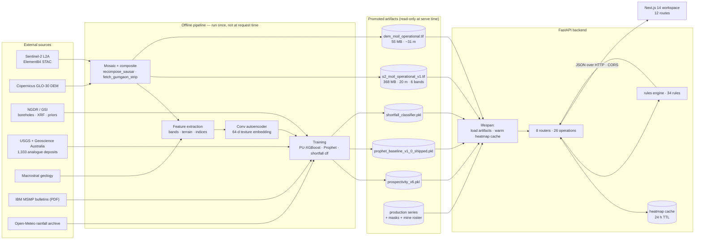
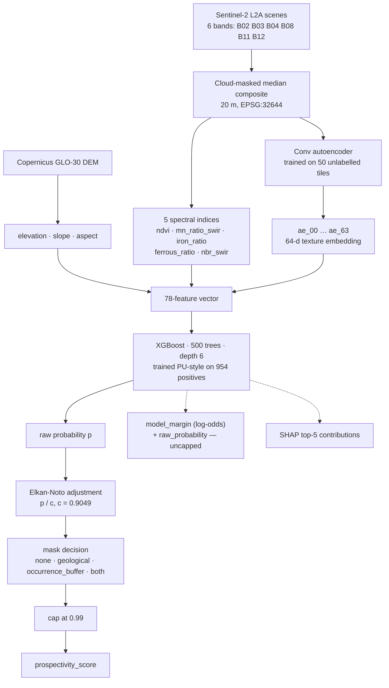
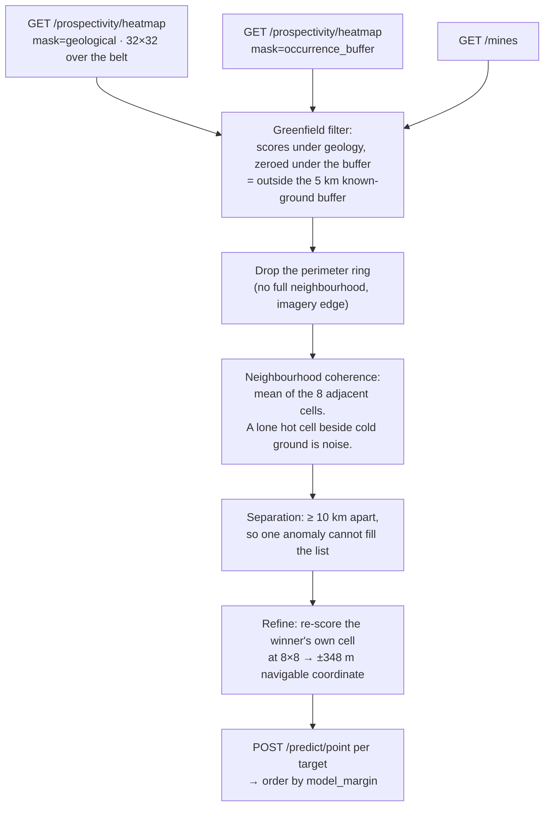
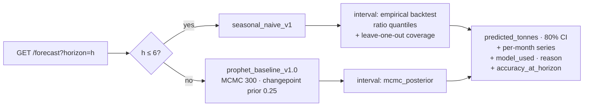
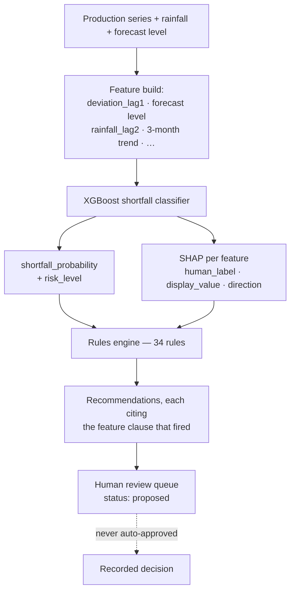
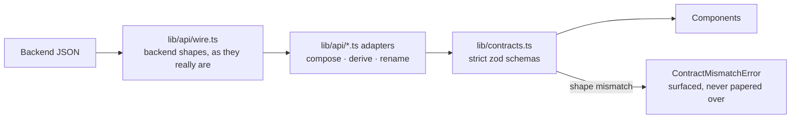
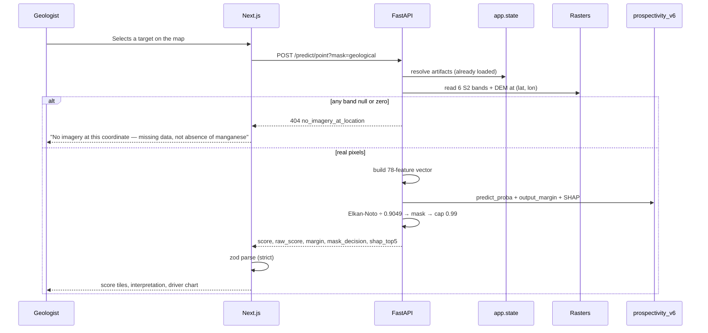

# SIH26009 — System Design Review

**Manganese Prospectivity & MOIL Production Intelligence**
Ministry of Steel · MOIL Limited · Smart India Hackathon 2026

| | |
|---|---|
| **API** | FastAPI `0.2` · 26 operations · contract `v1.10` |
| **Prospectivity model** | `prospectivity_v6.pkl` — PU-learning XGBoost, 78 features |
| **Forecast models** | `seasonal_naive_v1` (1–6 months) · `prophet_baseline_v1.0` (12 months) |
| **Frontend** | Next.js 14 App Router · 12 routes · strict runtime contracts |
| **Tests** | 298 backend · 32 frontend unit · 19 end-to-end |
| **Study area** | Sausar Belt — 79.0–80.6° E, 21.3–22.1° N (≈173 × 90 km) |

> This document is the **system design review**: what the system does, how the
> parts connect, what the numbers mean, and what the system refuses to claim.
> For the file-by-file developer reference see `ARCHITECTURE.md`; for setup from
> a clean clone see `BOOTSTRAP.md`; for defects see `docs/known_issues.md`.

---

## 0. Read this first

The problem statement asks three questions. The system answers each with a
separate pipeline, and the three meet in one API.

| # | Question | Answer produced | Served by |
|---|---|---|---|
| 1 | **Where is manganese likely to be?** | A prospectivity score for any coordinate in the belt, with the features that drove it | `/predict/point`, `/prospectivity/heatmap` |
| 2 | **How much will MOIL produce?** | A monthly forecast with an 80% interval, from the model that actually wins at that horizon | `/forecast`, `/forecast/history` |
| 3 | **Will next month fall short, and what should be done?** | A calibrated shortfall probability, the features behind it, and rule-derived corrective actions | `/shortfall/risk`, `/recommendations` |

**The single most important design decision:** the system distinguishes
*"we do not know"* from *"there is nothing there"*, everywhere, without
exception. A cell outside the imagery footprint returns `null`, not `0.0`. A
coordinate with no Sentinel-2 pixels returns `404 no_imagery_at_location`, not a
score computed from blank data. A component that fails is named in `degraded`
rather than silently substituted. This is the difference between a screening
tool an exploration geologist can act on and a demo that fabricates confidence.

### Verify any claim in this document

```bash
# 1. The model scores a real MOIL mine, with its uncapped classifier output
curl -X POST "http://127.0.0.1:8000/predict/point?mask=none" \
  -H "Content-Type: application/json" -d '{"lat": 21.9667, "lon": 80.4667}'   # Ukwa

# 2. The forecast says which model served it and why
curl "http://127.0.0.1:8000/forecast?horizon=3"

# 3. The shortfall probability ships with its own SHAP attribution
curl "http://127.0.0.1:8000/shortfall/risk"

# 4. The full test suite
pytest tests/ -q                      # 298 passed, 1 skipped
cd frontend && npx vitest run         # 32 passed
cd frontend && npx playwright test    # 16 passed, 3 skipped
```

---

## 1. System at a glance



### Three rules that shape the whole backend

| Rule | Why it exists | Where enforced |
|---|---|---|
| **Serve promoted artifacts only** | A training run once overwrote the served forecast model, and the API returned a *rejected* variant with `200`. Training writes to scratch paths; serving reads explicitly versioned files. | `src/api/state.py`, `src/models/prospectivity/predict.py` |
| **Degrade per component, never globally** | A missing shortfall model must not take down production history. Each artifact records its own load error. | `lifespan` → `app.state`; `/dashboard/summary` reports `degraded[]` |
| **Explain every number** | A score without a reason is not evidence. Prospectivity and shortfall both ship SHAP contributions; recommendations cite the feature that triggered them. | `shap_top5`, `feature_contributions`, rule `trigger` clauses |

---

## 2. Workflow 1 — Prospectivity mapping

### 2.1 How a score is made



### 2.2 Positive-unlabelled learning, and why it is the honest framing

There is no register of *"confirmed barren ground"* in the Sausar Belt. There
are places manganese has been found, and places nobody has looked. Training a
plain classifier would mean labelling the unexamined as negative — which teaches
the model that unexplored ground is barren, the exact opposite of what an
exploration tool should say.

The model therefore trains **positive-unlabelled**: 954 positives against 2,399
samples, with the unlabelled treated as unlabelled. The **Elkan-Noto constant
`c = 0.9049`** estimates the probability that a true positive was labelled, and
dividing by it converts the classifier's output into a prospectivity estimate.

| Training input | Count | Source |
|---|---|---|
| Real boreholes | 46 | NGDR / GSI bundle |
| NGDR national occurrence records | 490 | National Geoscience Data Repository |
| Surface XRF samples + block grade priors | — | GSI bundle |
| Foreign analogue deposits | 1,333 | USGS + Geoscience Australia (pretraining) |
| **Total training samples / positives** | **2,399 / 954** | `models/prospectivity_v6.pkl` |

### 2.3 Feature composition

| Group | Count | Features |
|---|---|---|
| Sentinel-2 reflectance | 6 | `b02` `b03` `b04` `b08` `b11` `b12` |
| Terrain | 3 | `elevation` `slope` `aspect` |
| Spectral indices | 5 | `ndvi` · `mn_ratio_swir` · `iron_ratio` · `ferrous_ratio` · `normalised_burn_ratio_swir` |
| Autoencoder texture embedding | 64 | `ae_00` … `ae_63` |
| **Total** | **78** | |

Recorded v6 gain importance: **terrain 25.3%** across three features, against
**61.8%** spread over all 64 embedding dimensions. Elevation is a top-two driver
at nine of the ten MOIL mines — the belt's ore sits in a specific topographic
setting, and the model has learned that setting.

### 2.4 Geological masks — screening, not scoring

A mask never changes the model's opinion. It records a policy decision *beside*
the raw score, and both are returned.

| Mask | What survives | Source |
|---|---|---|
| `none` | Everything — raw model output | — |
| `geological` | Precambrian metasedimentary basement only; Deccan Trap basalt and younger cover excluded | Macrostrat 1:5M proxy (production target: GSI Bhukosh 1:50K) |
| `occurrence_buffer` | Ground within 5 km of a confirmed manganese occurrence — a union of per-point buffers, not a hull | Derived from NGDR occurrences |
| `both` | Basement **and** within 5 km of an occurrence | Intersection |

At 1:5M the geological boundaries are tens of kilometres coarse. That separates
basement from trap rock; it does not separate a field from an outcrop, and the
`/masks` endpoint says so in its own description rather than leaving the user to
assume precision the data does not carry.

### 2.5 Serving footprint

| Raster | Extent | Resolution | Size |
|---|---|---|---|
| `s2_moil_operational_v1.tif` | 8,672 × 4,493 px, EPSG:32644, 6 bands | 20 m | 368 MB |
| `dem_moil_operational.tif` | 6,012 × 2,880 px, EPSG:4326 | ~31 m | 55 MB |

The serving mosaic is **the mosaic v6 was trained on**, plus a western strip
covering Gumgaon. This matters: an earlier build scored from a *different*
mosaic than training used, and gaps in it read as zero reflectance rather than
as missing data — fabricating roughly a quarter of the warm heatmap. Both the
mismatch and the blank-pixel bug are fixed, and `has_imagery()` now requires all
six bands to be non-null **and** non-zero before any coordinate is scored.

---

## 3. Reading prospectivity scores honestly

### 3.1 The ten MOIL mines, scored at their cited coordinates

Measured live against `prospectivity_v6` with `mask=none`:

| Mine | State | Type | Score | Margin | Coordinate confidence |
|---|---|---|---|---|---|
| Ukwa | MP | underground | **0.99** | 4.48 | high |
| Kandri | MH | underground | **0.99** | 3.11 | high |
| Chikla | MH | underground | **0.99** | 2.87 | high |
| Munsar | MH | underground | **0.99** | 2.72 | medium-high |
| Beldongri | MH | underground | **0.99** | 2.52 | **low** |
| Gumgaon | MH | underground | **0.97** | 1.98 | high |
| Tirodi | MP | opencast | **0.68** | 0.49 | low-medium |
| Balaghat | MP | underground | **0.34** | −0.83 | high |
| Dongri Buzurg | MH | opencast | **0.33** | −0.87 | low-medium |
| Sitapatore | MP | opencast | **0.12** | −2.14 | high |

Every mine now returns a **real score from real imagery** — none is scored from
a blank patch, and none is outside the footprint. Seven of ten score above 0.68.
Three do not, and that is reported rather than patched.

**Why the three low scores are a finding, not a failure.** Score and
distance-to-training-data are not the same thing: Gumgaon scores 0.97 while
sitting 7.6 km from the nearest training positive, and Balaghat scores 0.34
while sitting 1.5 km from one. The model is not merely recognising ground it was
trained on — which is precisely what makes its scores worth anything. Balaghat is
a deep underground mine; the ore is a kilometre below a surface the satellite
reads as ordinary. A surface-reflectance model that scored it 0.99 would be
telling us about the mine's location, not about the rock.

### 3.2 The 0.99 cap, and the number that breaks the tie

`prospectivity_score` divides the raw probability by `c = 0.9049` and caps the
result at **0.99**. Consequently **any raw probability ≥ 0.8959 displays as
0.99** — and that is not a fringe case, it is most of the interesting ground.

`POST /predict/point` therefore also returns the classifier's uncapped output
(contract v1.10), related exactly by `raw_probability = σ(model_margin)`:

| Field | Meaning |
|---|---|
| `prospectivity_score` | PU-adjusted, mask-applied, capped — what the map renders |
| `raw_probability` | `predict_proba` before adjustment and cap, range 0–1 |
| `model_margin` | The same prediction in log-odds, unbounded — the field to **rank** on |

This is why the Explorer's ten targets, all showing 0.99, are nonetheless
strictly ordered: their margins run 5.849 down to 2.274 (raw p 0.997 → 0.907).

### 3.3 Heatmap cell states — four states, never conflated

| State | Meaning | Render as |
|---|---|---|
| `null` | **No data** — outside the footprint, or a composite gap | Transparent or a "no data" hatch. **Never** the bottom of the colour scale. |
| `0.0` | A genuine low score, **or** a cell a mask excluded | Bottom of the scale |
| `0 < s ≤ 0.99` | A real score | On the scale |
| `> 0.99` | Cannot occur | Legend maximum reads "≥ 0.99", not 1.0 |

23.9–43.9% of cells score ≥ 0.90 depending on viewport, and 17–33% sit exactly
at the cap. A linear ramp therefore paints a large share of the map one colour;
`docs/frontend_heatmap_guidance.md` carries measured distributions and
percentile breakpoints per viewport.

### 3.4 How the ten greenfield targets are chosen

There is no "top targets" endpoint. The frontend composes three existing ones,
and every step is a measured criterion rather than an array position:



193 of 1,024 cells sit at the cap, so score alone leaves a 193-way tie.
Ranking by distance-from-mine was tried first and **rejected**: that measure
maximises at the corners of the bounding box, so it selected the edge of the
study area rather than geology.

---

## 4. Workflow 2 — Production forecasting

### 4.1 The series

| Property | Value |
|---|---|
| Source | IBM Monthly Statistics of Mineral Production bulletins (PDF) |
| Range | 2016-01 → 2026-05 |
| Months present / missing | 123 / 2 |
| Recovered by OCR | 5 |
| Latest actual (MH + MP) | 214,624 t · all-India 439,949 t |

Seven bulletins do not parse as text; five were recovered by OCR and two remain
unrecoverable. The gaps are reported in `series_health`, not interpolated away.

### 4.2 Horizon-adaptive model routing



The choice is **measured, not assumed**. Rolling-origin backtests over 82
origins showed a seasonal-naive baseline beating Prophet at short horizons, so
the API serves the winner and says which one it served and why. Reporting
Prophet's accuracy while serving a naive model — or vice versa — would be a
silent misattribution, so `accuracy_at_horizon` always describes the **served**
model and carries `prophet_mape` alongside for comparison.

### 4.3 A live example (horizon 3)

| Field | Value |
|---|---|
| `target_period` | 2026-08 |
| `predicted_tonnes` | 176,756 t |
| 80% interval | 156,765 – 217,955 t |
| `model_used` / `reason` | `seasonal_naive` / `seasonal_naive_beats_prophet_at_short_horizon` |
| `interval_method` | `empirical_backtest_ratio_quantiles` |
| MAPE (served) / Prophet MAPE | 10.05% / 11.74% |
| Realised 80% coverage | 73.9% over 23 origins |

At horizon 12 the routing flips: `model_used: prophet`, reason
`prophet_beats_seasonal_naive_at_long_horizon`, MAPE 9.92% against the naive
baseline's 10.16% — a skill of 0.24 pp — with `interval_method: mcmc_posterior`
and realised coverage 71.4% over 14 origins.

**Both intervals under-cover.** Nominal 80%, realised 73.9% at horizon 3 and
71.4% at horizon 12. That is stated in
the payload rather than hidden, because a decision-maker sizing a buffer needs
to know the band is optimistic. `series` returns one `{month, p10, p50, p90}`
point per month of the horizon, so a chart never has to interpolate between the
origin and the terminal point.

---

## 5. Workflow 3 — Shortfall risk and corrective actions



**Shortfall is defined, not vibed:** *actual production below 90% of the Prophet
forecast for that month*. Live, that is a threshold of 181,155 t against a
forecast of 201,284 t for 2026-06, giving a probability of **0.107** — risk
level `low`.

Each contribution is returned in a form a human can read directly:

| Feature | Value | SHAP | Direction |
|---|---|---|---|
| Last month vs forecast | +7.4% | −1.504 | decreases risk |
| Forecast production level | 201,284 t | −1.158 | decreases risk |
| Rainfall 2 months ago | 1.5 mm | +1.027 | **increases risk** |
| 3-month production trend | +11.7% vs prior quarter | … | … |

The 34 rules cover hydraulic sand stowing, wet-season face re-sequencing,
blast-to-mucking windows, SDL reallocation, rock-mechanics monitoring cadence,
bench drainage, haul-road repair and dumper rotation, among others. **The system
never acts.** It proposes, attaches evidence, and assigns a reviewer; approval is
a human act that the register records.

> **Demo note.** Because live shortfall risk is currently `low`, the engine
> correctly recommends **nothing**, so the review register and Corrective Actions
> page render empty against the live API. That is the system refusing to
> manufacture work, not a failure — but it is worth choosing a scenario month
> (`/recommendations/scenario/{month}`) or fixture mode before demonstrating
> those two modules.

---

## 6. The API surface

26 operations across 8 routers. Flat, machine-readable errors throughout:
`{error_code, detail, remedy}`.

| Domain | Operations |
|---|---|
| **Prospectivity** | `POST /predict/point` · `POST /predict/points_in_bbox` (+ deprecated `/predict/bbox`) · `GET /prospectivity/heatmap` · `GET /masks` · `GET /predictions/{id}` |
| **Mines** | `GET /mines` · `GET /mines/{mine_name}` |
| **Forecasting** | `GET /forecast` · `GET /forecast/history` · `GET /production/history` · `POST /forecast/retrain` · `GET /forecast/retrain/{task_id}` |
| **Risk & actions** | `GET /shortfall/risk` · `GET /recommendations` · `GET /recommendations/scenario/{month}` · `GET /dashboard/summary` |
| **Reference data** | `GET /boreholes` · `/boreholes/{id}` · `/boreholes/{id}/features` · `GET /priors` · `/priors/{block}` · `GET /foreign` |
| **Training** | `POST /train` · `GET /train/{task_id}` |

| Status | Meaning |
|---|---|
| `404 no_imagery_at_location` | The served mosaic has no real pixels there. **Missing data, not absent manganese.** |
| `422` | Validation failure, with the offending field named |
| `500 model_not_loaded` | That artifact failed to load; other endpoints continue to serve |
| `501` | An endpoint deliberately stubbed for the demo, labelled as such |

Heatmaps are cached to disk with a 24-hour TTL and **warmed asynchronously at
startup** for three viewports at `grid_size=32`. The API is available
immediately; a cold heatmap takes ~38 s, a warm one is instant, and `cached:
true` tells the client which it got.

---

## 7. The frontend

### 7.1 Contract pipeline — the frontend cannot invent a field



Every payload is parsed by a **strict** zod schema at runtime. A backend field
that changes shape produces a visible `ContractMismatchError` rather than a
component silently rendering `undefined`. Nullable stays nullable: a mine with
no source URL renders as plain text, not a dead link.

### 7.2 Routes

| Route | Purpose |
|---|---|
| `/` | Landing story — the case for the system, in ten chapters |
| `/operations` | Command Center — vital signs, forecast + risk, review queue |
| `/explorer` | **Prospectivity** — heatmap, masks, 10 MOIL mines + 10 model targets, SHAP |
| `/mines` | Mine fleet roster, scored at cited coordinates with provenance |
| `/production` | Forecast intervals, shortfall gauge, evidence rail |
| `/actions` | Corrective actions, human review, audit trail |
| `/assets` · `/feedback` · `/pipeline` · `/compliance` · `/reports` · `/admin` | Supporting modules |

### 7.3 The Explorer, in detail

Two icon classes on one map: a **headframe** marks each of the ten operating
MOIL mines; a **crosshair** marks each of the ten model targets. Selecting
either scores that exact coordinate through `/predict/point` under the active
mask, and the inspector shows raw score, screened score, mask decision,
classifier margin and the SHAP contributions behind it. Each target carries a
copyable decimal coordinate, an "Open in Maps" link, its distance and bearing
from the nearest mine, its neighbourhood coherence and its ±348 m precision.

### 7.4 Two modes

`NEXT_PUBLIC_API_BASE_URL` set → **live mode**, everything from the API.
Unset → **fixture mode**, a self-contained demonstration that labels itself
"Demonstration fixtures · no API configured" on screen. The distinction is
visible to the viewer, never blurred.

---

## 8. Integrity rules — the decisions that matter most

| Rule | Concretely |
|---|---|
| **Missing ≠ zero** | `null` heatmap cells; `404 no_imagery_at_location`; `—` in tables, never a substituted number |
| **Raw score is preserved under masking** | A masked cell returns `0.0` *and* its raw score *and* the mask reason. The exclusion is auditable. |
| **Scores are screening indices** | Never ore tonnage, recoverable volume, reserve certification or environmental clearance. Stated on every surface that shows one. |
| **The cap is disclosed** | `score_range.cap` ships in the payload; legends read "≥ 0.99"; the uncapped margin is available for ranking |
| **Out of scope returns nothing** | Sandur and Bonai are outside the study area. The system says *"no prediction"*, not *"zero"*. |
| **Coordinates are cited** | Every mine carries `source`, `source_url`, `confidence` and `coordinate_precision`. Six mines still lack a full URL and are marked accordingly rather than dressed up. |
| **Provenance is on screen** | `data_origin`, `model_version` and `generated_at` travel with every adapted payload |
| **Humans decide** | No recommendation is auto-approved. "No reviewed actions. The demonstration does not fabricate approvals." |

---

## 9. Request lifecycle



---

## 10. Testing and verification

| Suite | Count | Covers |
|---|---|---|
| Backend `pytest` | **298 passed**, 1 skipped | Model contracts, mask logic, imagery guards, coordinate provenance, forecast routing, error bodies |
| Frontend `vitest` | **32 passed** | Contract schemas, adapters, target ranking and ordering, mine roster |
| End-to-end `playwright` | **16 passed**, 3 skipped | Route health across all 12 routes, Explorer selection and masks, narrow-viewport navigation |

Representative guarantees rather than happy-path clicks:

- `test_predict_point_exposes_the_uncapped_classifier_output` asserts
  `σ(model_margin) ≈ raw_probability` **and** `prospectivity_score ≤ 0.99`.
- `route-health.spec.ts` fails on any console error, page error, 4xx on a
  `_next` asset, or error boundary, on every route.
- A targets test asserts the shortlist is ordered by margin, and a second
  asserts it **keeps** the shortlist order when a backend sends no margin — a
  partial sort would mix two orderings and read as neither.
- The three skipped e2e specs assert fixture content (a 32% shortfall, a
  four-row register) that live mode cannot produce; they skip with that reason
  stated, and run with `NEXT_PUBLIC_API_BASE_URL` unset.

---

## 11. Known limits

Stated plainly, because a system that hides these is harder to trust than one
that does not.

| Limit | Status |
|---|---|
| Forecast intervals under-cover (73.9% realised against nominal 80%) | Measured and reported in every payload |
| `POST /predict/points_in_bbox` returns a non-griddable point set | Known (`known_issues.md` #1); the map uses `/prospectivity/heatmap` instead |
| Geological mask is a 1:5M proxy | Boundaries are tens of km coarse; production target is GSI Bhukosh 1:50K |
| Six mine coordinates lack a full source URL | Marked `low`/`low_medium` confidence with the gap recorded in the audit trail |
| Three mines score below 0.4 | Explained in `docs/mine_score_distribution_analysis.md`; not patched |
| Deep ore is invisible to a surface model | Structural: Balaghat's ore is ~1 km down |
| Mine labels overlap in the Nagpur cluster | Cosmetic, open |
| Rainfall is the only weather regressor | Strikes, permit disputes and logistics sit outside the model |

---

## 12. Technology stack

| Layer | Technology | Why |
|---|---|---|
| API | FastAPI + Pydantic v2 | Typed request/response contracts, automatic OpenAPI |
| Prospectivity | XGBoost (PU-learning, Elkan-Noto) | Tabular, explainable, strong on small labelled sets |
| Explainability | SHAP TreeExplainer | Per-prediction attribution in log-odds |
| Texture features | PyTorch conv autoencoder | 64-d embedding from 50 unlabelled tiles — no labels needed |
| Forecasting | Prophet + seasonal-naive | Interpretable trend/seasonality, with an honest baseline that often wins |
| Geospatial | rasterio, shapely, GeoPandas, PostGIS | Windowed reads, mask geometry, spatial queries |
| Document recovery | pdfplumber + OCR | 5 of 7 unparseable MSMP bulletins recovered |
| Storage | Supabase Postgres + PostGIS, Parquet, GeoTIFF | Relational reference data, columnar features, tiled rasters |
| Frontend | Next.js 14 App Router, React 18, TypeScript | Server components for data pages, client islands for the map |
| Validation | zod (strict) | Runtime contract enforcement at the boundary |
| Map | MapLibre GL / Mapbox GL | Token-optional rendering with a tokenless fallback |
| State / charts | zustand · Recharts | Minimal selection store; accessible charts |
| Testing | pytest · vitest · Playwright | Unit, contract and browser-level verification |

---

## 13. Repository map

```
src/
  api/          FastAPI app · 8 routers · schemas · errors · lifespan state
  config/       settings: paths, masks, warm viewports, cited MOIL_MINES
  data/         ingest/ (STAC, MSMP, NGDR, rainfall) · preprocess/ (features, OCR)
  models/
    prospectivity/   predict.py — scoring, masks, imagery guards, SHAP
    forecast/        Prophet + seasonal-naive, backtests, intervals
    shortfall/       classifier + attribution
    recommendations/ engine.py + rules.py (34 rules)
models/         Promoted artifacts only (*.pkl, *.pt)
data/
  raw/          Rasters, geology GeoJSON, source documents
  processed/    Feature parquets, diagnostics
  cache/        Heatmap responses, 24 h TTL
frontend/
  app/          12 routes (App Router)
  components/   explorer/ · mines/ · operations/ · landing/ · ui/
  lib/          api/wire.ts · api/*.ts adapters · contracts.ts
  hooks/ stores/ tests/
docs/
  phase_4/api_contracts.md      Contract v1.10 — the frontend's source of truth
  known_issues.md               Every defect, with evidence
  mine_score_distribution_analysis.md
  moil_coordinate_sources.md    Coordinate audit trail
  frontend_heatmap_guidance.md  Measured score distributions per viewport
ARCHITECTURE.md   File-by-file developer reference
BOOTSTRAP.md      Clean-clone setup
SYSTEM_DESIGN.md  This document
```

---

## 14. Suggested demonstration path

1. **`/`** — the belt, the gap, and what screening does. Thirty seconds.
2. **`/explorer`** — ten headframes (operating mines) and ten crosshairs (model
   targets) on one map. Select Ukwa: 0.99, driven by elevation and texture.
   Select target **T1**, 19 km N of Kandri: a navigable coordinate, ±348 m,
   outside the 5 km known-ground buffer, margin 5.85.
3. **Toggle the geological mask** — watch scores survive or zero out, with the
   raw score preserved beside the exclusion.
4. **Select Balaghat: 0.34.** Explain it rather than hide it — deep ore, surface
   sensor. This is the moment that shows the model is reading rock, not
   memorising mine locations.
5. **`/production`** — the 80% interval, and the stated 73.9% realised coverage.
6. **`/operations`** — shortfall probability with its SHAP attribution, and the
   review queue that never approves itself.

---

*Every figure in this document was measured against the running system on
2026-09-17. Where a number is uncertain, the uncertainty is stated rather than
rounded away.*
